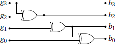

Transcodificatore Gray-Binary
=============================

A Gray-binary transcoder.

Academic project, _Apparati Elettronici_, Laurea Magistrale in Ingegneria Informatica, Università di Pisa.


Specifiche
==========

Struttura generale
------------------

Si progetti un circuito sequenziale sincrono in grado di leggere una parola di lunghezza pari a 4 bit che esprime un numero binario, la traduca in una parola espressa in codifica Gray.

Tutti gli elementi con memoria siano inizializzabili al valore logico 0 tramite il segnale `RST_N` (attivo basso).


Consegna
--------

La relazione finale del progetto deve contenere:

  * Introduzione (descrizione algoritmo, possibili applicazioni, possibili architetture, etc.)
  * Descrizione dell’architettura (diagramma a blocchi, ingressi/uscite, etc.)
  * Codice VHDL (con commenti dettagliati)
  * Testbench per la verifica
  * Conclusioni


Svolgimento
===========

Introduzione
------------

I codici di Gray sono usati per codificare sequenze ordinate di numeri, in modo tale che un numero della sequenza differisca dal successivo (o dal precedente) per il valore di un solo bit. Non si tratta di un codice posizionale, ovvero non è assegnato ai bit alcun peso a seconda della loro posizione.

Data una sequenza ordinata di numeri, non esiste per essi una codifica univoca di codici di Gray. Un modo semplice per generare una sequenza di codici di Gray, a partire da una sequenza numerica binaria, è descritto dal seguente algoritmo:

  1. siano

     > *b* = *bₙ*₋₁...*b*₀   e   *g* = *gₙ*₋₁ ... *g*₀

     i due valori rispettivamente in ingresso (un numero intero espresso in codifica binaria) e in uscita (il rispettivo codice di Gray);

  2. si copia il bit più significativo dell'ingresso in uscita:

     > *gₙ*₋₁ = *bₙ*₋₁

  3. per ciascun bit seguente *gᵢ* si calcola

     > *gᵢ* = *bᵢ*₊₁ ⊕ *bᵢ*.

Nel listato **1** viene mostrato lo pseudo-codice equivalente per la conversione di un numero su 4 bit. Con `b[i]` e `g[i]` si accede ai singoli bit dei due codici.

```
g[3] = b[3];
for (i = 2; i >= 0; i--) {
  g[i] = b[i + 1] ^ b[i];
}
```
**Listato 1.** Algoritmo di conversione di un numero binario a 4 bit in codifica di Gray.


### Possibili usi

I codici di Gray sono ampiamente usati in tutti quei contesti in cui è necessario eseguire un *mapping* tra un valore analogico (che può variare continuamente entro un certo intervallo) e un valore digitale (costituito da una sequenza di bit di una certa lunghezza). Essi sono spesso usati nel campo delle comunicazioni digitali, al fine di minimizzare gli errori su bit e rendere più efficaci i meccanismi di rilevazione e correzione degli errori.

In un sistema di comunicazione PAM *M*-ario (in banda base), per esempio, la codifica di Gray viene usata per associare una sequenza di bit (log₂*M* bit) a ciascuno degli *M* simboli dell'alfabeto. Così facendo, i livelli adiacenti corrispondono a parole di codice che differiscono per un solo bit, con il vantaggio che un errore del decisore (che solitamente accade tra due livelli adiacenti) comporta un errore su un solo bit. Ciò consente di rendere più probabile la correzione dell'errore con opportuni meccanismi.

Un altro contesto di applicazione della codifica di Gray si ha quando è necessario evitare alee (*glitch*) dovute alla commutazione di più bit in un circuito, per esempio in uscita a un sensore. Essendo improbabile, a causa delle imperfezioni e asimmetrie nei circuiti, che due o più bit di una cifra possano commutare esattamente nello stesso istante, viene a crearsi una configurazione fisica intermedia in cui è codificato un valore indesiderato, che può generare errore nella successiva elaborazione. Negli encoder che utilizzano codici di Gray, il passaggio da un valore a quello immediatamente più piccolo o più grande comporta la variazione di un unico bit, eliminando errori dovuti a codifiche binarie intermedie.

|                 |     |     |     |     |     |     |     |     |
|-----------------|-----|-----|-----|-----|-----|-----|-----|-----|
| **Binary code** | 000 | 001 | 010 | 011 | 100 | 101 | 110 | 111 |
| **Gray code**   | 000 | 001 | 011 | 010 | 110 | 111 | 101 | 100 |

**Tabella 1.** Conversione tra codice binario e codice di Gray.


### Schema a blocchi e realizzazione

La figura **1** riporta lo schema a blocchi del codificatore progettato. Si tratta di un circuito sincrono, la cui evoluzione è dettata dal segnale di *clk*. In ingresso viene data una parola *b* di *N* bit contenente un numero naturale con codifica binaria. L'uscita *g* conterrà, *al ciclo di clock successivo*, un codice di Gray corrispondente alla valore dato in ingresso secondo un mapping analogo a quello riportato nella tabella **1** (esteso su *N* bit). In ingresso alla rete viene data anche la linea di reset (attiva bassa), in modo da forzare l'uscita a zero quando attiva.

L'implementazione del transcodificatore può essere realizzata mediante un certo numero di porte XOR connesse come illustrato nella figura **2** (*N* = 4), in accordo all'algoritmo in pseudo-codice già visto (listato **1**).

Nella figura **3** è riportata l'implementazione di un convertitore inverso da codici di Gray a codici binari. Come si evince dallo schema, anche in questo caso la realizzazione in termini di porte logiche è piuttosto semplice.

> 

**Figura 1.** Schema a blocchi del convertitore binario/Gray.

> 

**Figura 2.** Realizzazione di un convertitore binario/Gray a 4 bit.

> 

**Figura 3.** Realizzazione di un convertitore Gray/binario a 4 bit.


Codice VHDL
-----------

I listati che seguono mostrano per intero il codice VHDL del transcodificatore da codice binario in Gray e viceversa. Si è scelto una implementazione di tipo *behavioural*, in quanto è la notazione più compatta e di alto livello e, di conseguenza, quella meno incline a errori.

```vhdl
-------------------------------------------------------------------------------
-- (Behavioral)
--
-- File name : binary_to_gray.vhdl
-- Purpose   : A Binary to Gray converter
--           :
-- Author(s) : Antonio Macrì
-------------------------------------------------------------------------------

library IEEE;
use IEEE.std_logic_1164.all;

entity binary_to_gray is
    generic(N : positive := 4);
    port(clk   : in  std_logic;
         reset : in  std_logic;         -- Active low
         b     : in  std_logic_vector(N - 1 downto 0);
         g     : out std_logic_vector(N - 1 downto 0)
    );
end;

architecture BEHAVIOURAL of binary_to_gray is
begin
    process(clk, reset)
    begin
        -- If reset is active, force the output to all-zero
        if (reset = '0') then
            g <= (others => '0');

        elsif (rising_edge(clk)) then
            g(N - 1) <= b(N - 1);
            for i in N - 2 downto 0 loop
                g(i) <= b(i + 1) xor b(i);
            end loop;
        end if;
    end process;
end;
```

**Listato 2.** `binary_to_gray.vhdl`.

```vhdl
-------------------------------------------------------------------------------
-- (Behavioral)
--
-- File name : gray_to_binary.vhdl
-- Purpose   : A Gray to binary converter
--           :
-- Author(s) : Antonio Macrì
-------------------------------------------------------------------------------

library IEEE;
use IEEE.std_logic_1164.all;

entity gray_to_binary is
    generic(N : positive := 4);
    port(clk   : in  std_logic;
         reset : in  std_logic;         -- active low
         g     : in  std_logic_vector(N - 1 downto 0);
         b     : out std_logic_vector(N - 1 downto 0)
    );
end;

architecture BEHAVIOURAL of gray_to_binary is
begin
    process(clk, reset)
        -- We need to use a variable since the output b is obtained from the
        -- input g and the output itself, but b is not readable (since it is
        -- declared 'out')
        variable b_buf : std_logic_vector(N - 1 downto 0);
    begin
        -- If reset is active, force the output to all-zero
        if (reset = '0') then
            b <= (others => '0');

        elsif (rising_edge(clk)) then
            b_buf(N - 1) := g(N - 1);
            for i in N - 2 downto 0 loop
                b_buf(i) := b_buf(i + 1) xor g(i);
            end loop;
            b <= b_buf;
        end if;
    end process;
end;
```

**Listato 3.** `gray_to_binary.vhdl`.


Testbench
---------

In questo paragrafo vengono presentati i testbench usati per la verifica e la simulazione dei due transcodificatori diretto e inverso esposti nei paragrafi precedenti.

Per la verifica e la simulazione, sono stati progettati due testbench:

  1. il primo verifica che l'output del convertitore binario/Gray generi in uscita una sequenza di codici che rispettino effettivamente una codifica di Gray, ossia tale per cui due elementi consecutivi della sequenza differiscano esattamente per un solo bit;
  2. il secondo testbench verifica che il transcodificatore da codice binario a codice di Gray e quello da codice di Gray a codice binario siano effettivamente l'uno l'inverso dell'altro, ovvero che il secondo permetta di risalire al codice binario originario a partire dal codice di Gray generato dal primo.

Le figure **4** e **5** ne illustrano il funzionamento.

> 

**Figura 4.** Schema del primo testbench per la verifica e la simulazione del transcodificatore per codice binario/Gray.

> 

**Figura 5.** Schema del secondo testbench per la verifica e la simulazione del transcodificatore per codice binario/Gray.

Per quanto riguarda il primo testbench, la rete *R*₁ è un circuito sequenziale sincrono che genera in uscita, a ogni ciclo di clock, un numero naturale *b* su 4 bit in codifica binaria. Al successivo ciclo di clock, il convertitore `B2G` produrrà in uscita (*g*) il corrispondente codice di Gray. Quest'ultimo viene fatto passare attraverso un registro al fine di ritardarlo di un ciclo di clock: in questo modo è possibile confrontare ciascun codice prodotto con il precedente. La serie costituita dallo XOR e dalla rete *R*₂ serve a controllare che i due codici *g'* e *g* differiscano per un solo bit. Affinché tutto funzioni, l'uscita *x* dello XOR deve essere una sequenza di bit costituita da tutti 0 tranne uno e un solo bit posto a 1. Ciò significa che *x* è una potenza di 2: in tal caso, per verificarlo bisogna controllare che

> *x* ⊕ (*x*-1) = 0.

Tuttavia, siccome *x* = 0 ricade in questa condizione pur non essendo un valore valido (significherebbe che due codici di Gray generati consecutivi sono uguali), bisogna accertarsi anche che sia *x* ≠ 0.

Il secondo testbench è orientato alla verifica dell'invertibilità della conversione. In gran parte riusa il codice del testbench precedente. La differenza fondamentale è che la rete *R*₃ deve controllare che le due sequenze in ingresso *b'* e *b* siano esattamente uguali. Inoltre, i due registri in basso servono a ritardare l'ingresso in modo da allinearlo all'uscita del convertitore `G2B`.

Nei listati seguenti viene riportato per intero il codice VHDL commentato dei due testbench.

```vhdl
-------------------------------------------------------------------------------
-- TestBench(binary_to_gray)
--
-- File name : binary_to_gray_test.vhdl
-- Purpose   : Generates stimuli for a binary to Gray converter
--           :
-- Author(s) : Antonio Macrì
-------------------------------------------------------------------------------

library IEEE;
use IEEE.std_logic_1164.all;
use IEEE.numeric_std.all;

entity binary_to_gray_tb is
end binary_to_gray_tb;

architecture binary_to_gray_test of binary_to_gray_tb is
    component binary_to_gray
        generic(N : positive);
        port(clk   : in  std_logic;
             reset : in  std_logic;
             b     : in  std_logic_vector(N - 1 downto 0);
             g     : out std_logic_vector(N - 1 downto 0)
        );
    end component;

    -- Input bits
    constant N           : integer := 4;
    -- Clock period
    constant ClockPeriod : time    := 100 ns;

    -- Clock
    signal clk : std_logic := '0';

    -- Input signals
    signal counter : integer                          := 0;
    signal binary  : std_logic_vector(N - 1 downto 0) := (others => '0');

    -- Output signals
    signal gray         : std_logic_vector(N - 1 downto 0);
    signal gray_delayed : std_logic_vector(N - 1 downto 0);
    signal gray_xored   : std_logic_vector(N - 1 downto 0);
    signal zero_bits    : std_logic_vector(N - 1 downto 0);
    signal result       : std_logic;

begin
    B2G : binary_to_gray
        generic map(N)
        port map(clk, '1', binary, gray);

    -- Generate the clock
    clk <= not clk after ClockPeriod / 2;

    -- Wire the input signal of the converter to the binary value of counter
    binary <= std_logic_vector(to_unsigned(counter, binary'length));

    -- Compute the XOR between two consecutive gray codes produced by the
    -- converter
    gray_xored <= gray xor gray_delayed;

    -- Check that the resulting XOR is a power of two (it includes zero!)
    zero_bits <= gray_xored and std_logic_vector(unsigned(gray_xored) - 1);

    process(clk)
    begin
        if (rising_edge(clk)) then
            counter      <= counter + 1;
            gray_delayed <= gray;
        end if;
    end process;

    process(gray_xored, zero_bits)
    begin
        -- If the XOR is a power of two, but different than zero, set result
        -- to 1
        if unsigned(zero_bits) = 0 and unsigned(gray_xored) /= 0 then
            -- It works!
            result <= '1';
        else
            -- Something wrong!
            result <= '0';
        end if;
    end process;

end binary_to_gray_test;
```

**Listato 4.** `binary_to_gray_test.vhdl`.

```vhdl
-------------------------------------------------------------------------------
-- TestBench(gray_to_binary)
--
-- File name : gray_to_binary_test.vhdl
-- Purpose   : Generates stimuli for a Gray to binary converter
--           :
-- Author(s) : Antonio Macrì
-------------------------------------------------------------------------------

library IEEE;
use IEEE.std_logic_1164.all;
use IEEE.numeric_std.all;

entity gray_to_binary_tb is
end gray_to_binary_tb;

architecture gray_to_binary_test of gray_to_binary_tb is
    component binary_to_gray
        generic(N : positive);
        port(clk   : in  std_logic;
             reset : in  std_logic;
             b     : in  std_logic_vector(N - 1 downto 0);
             g     : out std_logic_vector(N - 1 downto 0)
        );
    end component;
    component gray_to_binary
        generic(N : positive);
        port(clk   : in  std_logic;
             reset : in  std_logic;
             g     : in  std_logic_vector(N - 1 downto 0);
             b     : out std_logic_vector(N - 1 downto 0)
        );
    end component;

    -- Input bits
    constant N           : integer := 4;
    -- Clock period
    constant ClockPeriod : time    := 100 ns;

    -- Clock
    signal clk : std_logic := '0';

    -- Input signals
    signal counter : integer                          := 0;
    signal binary  : std_logic_vector(N - 1 downto 0) := (others => '0');

    -- Output signals
    signal gray             : std_logic_vector(N - 1 downto 0);
    signal binary_delayed_1 : std_logic_vector(N - 1 downto 0);
    signal binary_delayed_2 : std_logic_vector(N - 1 downto 0);
    signal binary_output    : std_logic_vector(N - 1 downto 0);
    signal result           : std_logic;

begin
    B2G : binary_to_gray
        generic map(N)
        port map(clk, '1', binary, gray);
    G2B : gray_to_binary
        generic map(N)
        port map(clk, '1', gray, binary_output);

    -- Generate the clock
    clk <= not clk after ClockPeriod / 2;

    -- Wire the input signal of the converter to the binary value of counter
    binary <= std_logic_vector(to_unsigned(counter, binary'length));

    process(clk)
    begin
        if (rising_edge(clk)) then
            counter          <= counter + 1;
            binary_delayed_1 <= binary;
            binary_delayed_2 <= binary_delayed_1;
        end if;
    end process;

    process(binary_delayed_2, binary_output)
    begin
        -- If the original binary code (delayed) is equal to the reconstructed
        -- code, set result to 1
        if binary_delayed_2 = binary_output then
            -- It works!
            result <= '1';
        else
            -- Something wrong!
            result <= '0';
        end if;
    end process;

end gray_to_binary_test;
```

**Listato 5.** `gray_to_binary_test.vhdl`.


### Simulazione

I due testbench già esposti sono stati simulati usando il tool Active-HDL della Aldec. Le figure **6** e **7** riportano i diagrammi temporali ottenuti.

Nel primo diagramma, si nota la tipica forma d'onda di una sequenza di bit che varia secondo un codice di Gray (termini `gray[i]`). In entrambi le figure è possibile verificare l'output `result` costantemente uguale a 1, a segnalare la correttezza dei risultati.

> 

**Figura 6.** Simulazione del primo testbench usando il tool Active-HDL.

> 

**Figura 7.** Simulazione del secondo testbench usando il tool Active-HDL.
